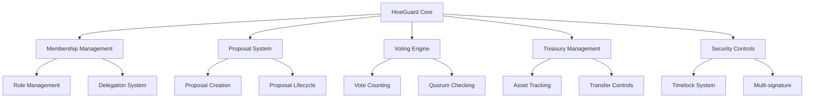

# HiveGuard DAO Manager

A secure and comprehensive framework for creating and managing DAOs on the Stacks blockchain, with customizable governance mechanisms and robust security controls.

## Overview

HiveGuard provides organizations with the tools needed to establish and operate decentralized autonomous organizations (DAOs) effectively. The system facilitates:

- Customizable governance structures with role-based access control
- Flexible proposal creation and voting mechanisms
- Delegation of voting power
- Multi-signature security for critical operations
- Time-locked execution for major changes
- Transparent treasury management
- Complete audit trails of all operations

## Architecture

HiveGuard is built around a core contract that handles all essential DAO operations while maintaining strict security controls.



## Contract Documentation

### HiveGuard Core Contract

The main contract managing all DAO operations.

#### Key Components:

1. **Membership System**
   - Role-based access control (Admin, Member, Delegate)
   - Voting power management
   - Delegation capabilities

2. **Proposal System**
   - Proposal creation and management
   - Customizable voting periods
   - Proposal execution tracking

3. **Security Features**
   - Multi-signature requirements for high-value operations
   - Time-locked execution for major changes
   - Quorum requirements for decisions

## Getting Started

### Prerequisites

- Clarinet installation
- Stacks wallet for deployment
- Basic understanding of Clarity smart contracts

### Installation

1. Clone the repository
```bash
git clone <repository-url>
```

2. Install dependencies
```bash
clarinet install
```

3. Test the contracts
```bash
clarinet test
```

### Basic Usage

1. Initialize a new DAO:
```clarity
(contract-call? .hiveguard-core initialize-dao 
    "MyDAO" 
    "Description" 
    none)
```

2. Add members:
```clarity
(contract-call? .hiveguard-core add-member 
    'ST1PQHQKV0RJXZFY1DGX8MNSNYVE3VGZJSRTPGZGM 
    u2  ;; ROLE_MEMBER
    u100 ;; voting power
    none)
```

3. Create a proposal:
```clarity
(contract-call? .hiveguard-core create-proposal 
    "Proposal Title"
    "Description"
    u0  ;; execution delay
    none 
    none 
    none 
    none 
    none)
```

## Function Reference

### Administrative Functions

```clarity
(add-member (principal uint uint (optional (string-utf8 500))) response)
(remove-member (principal) response)
(update-governance-params ((optional uint) (optional uint) (optional uint) (optional uint) (optional uint)) response)
```

### Member Functions

```clarity
(create-proposal ((string-ascii 100) (string-utf8 2000) uint (optional principal) (optional (string-ascii 128)) (optional (list 20 (string-utf8 500))) (optional (string-utf8 500)) (optional (string-utf8 1000))) response)
(vote-on-proposal (uint uint) response)
(delegate-vote (principal) response)
```

### Read-Only Functions

```clarity
(get-dao-info () response)
(get-proposal (uint) response)
(get-member (principal) response)
(check-membership (principal) response)
```

## Development

### Testing

Run the test suite:
```bash
clarinet test
```

### Local Development

1. Start local Clarinet console:
```bash
clarinet console
```

2. Deploy contracts:
```bash
clarinet deploy
```

## Security Considerations

1. **Role Management**
   - Only admins can add/remove members
   - Self-removal prevention
   - Role validation checks

2. **Proposal Safety**
   - Timelock for high-value operations
   - Multi-signature requirements
   - Quorum checks

3. **Treasury Protection**
   - Asset tracking
   - Transfer limits
   - Multi-signature requirements for large transfers

4. **Voting Security**
   - Single vote per proposal
   - Delegation controls
   - Vote weight validation